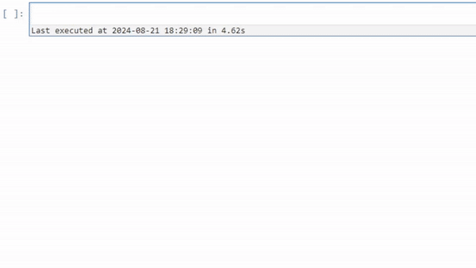
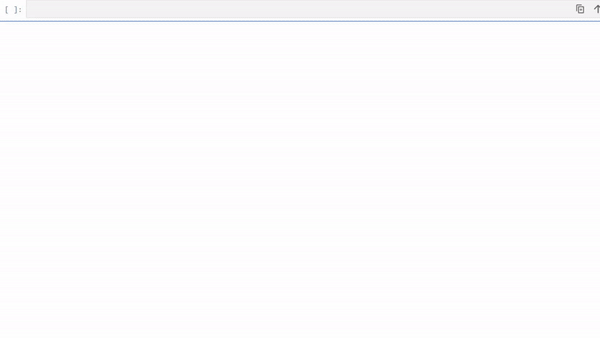

[](https://github.com/astral-sh/ruff)

[](https://bridge-ds.readthedocs.io/en/latest/?badge=latest)


```
    __         _     __                     __    
   / /_  _____(_)___/ /___ ____        ____/ /____
  / __ \/ ___/ / __  / __ `/ _ \______/ __  / ___/
 / /_/ / /  / / /_/ / /_/ /  __/_____/ /_/ (__  ) 
/_.___/_/  /_/\__,_/\__, /\___/      \__,_/____/  
                   /____/                         
```

_bridge-ds_ is a lightweight Python framework designed to provide a
unified interface to deep learning datasets from different
modalities: Perform global operations, aggregations and queries
with a Pandas-like
experience, and handle individual samples and raw data using a
class-based, tab-completion-ey interface.


# Contents

<!-- TOC -->
* [Contents](#contents)
* [Key Features](#key-features)
* [Installation](#installation)
* [Documentation](#documentation)
<!-- TOC -->

# Key Features

**Browse**



**Work with tables**


**Plot your data**


**Assign, sort and filter**



**Augment**


* **Explore data in your notebook:**
    
    * Browse your data directly in your notebook, without
      intermediary web-apps.
* **Dataset as a table:**
    
    * Give your deep learning dataset a DataFrame
      interface; making
      cumbersome operations such as selections, sorting and
      aggregations - easy.
* **Agnostic to Deep Learning Engines:**
    * Convert into a training-ready dataset
      in your DL framework of choice.
* **Transform and Debug:**
    * Maintain full visibility into your
      preprocessing/augmentation pipeline. See exactly which
      inputs enter your model.
* **Work with Arbitrary Sources**:
    * Work with remote and local data together, seamlessly.
* **Keep your data to yourself**:
    * No need to upload your data to third parties.

# Installation

You can install the latest version of Bridge's from PyPI. It comes in a few flavors:

*Core*: The core package includes the basic functionality of Bridge.

```bash
$ pip install bridge-ds
```
*Vision*: The vision package includes the core package and additional functionality for working with image datasets.


```bash
$ pip install bridge-ds[vision]
```
*Dev*: The dev package includes the core package and additional tools for development.

```bash
$ pip install bridge-ds[dev]
```

* _NOTE_: to run the notebooks you'll need both the `vision` and `dev` packages.
# Documentation

To learn more about bridge-ds, please visit the [official documentation](https://bridge-ds.readthedocs.io/).